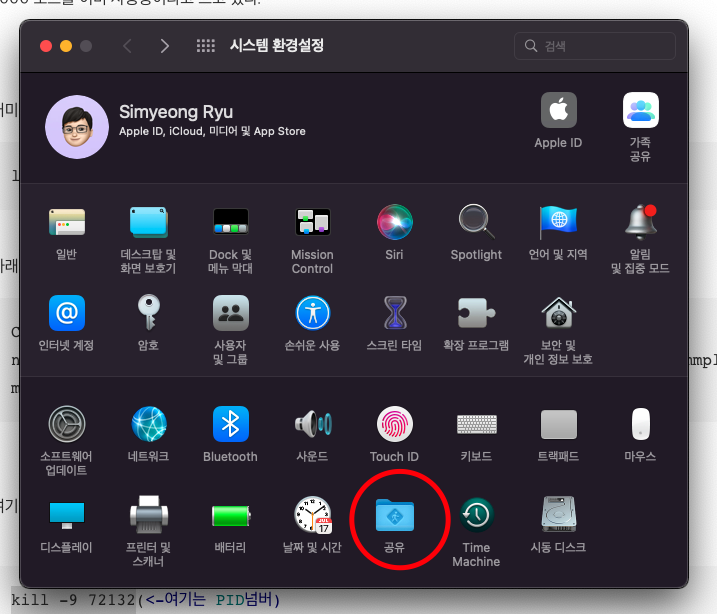
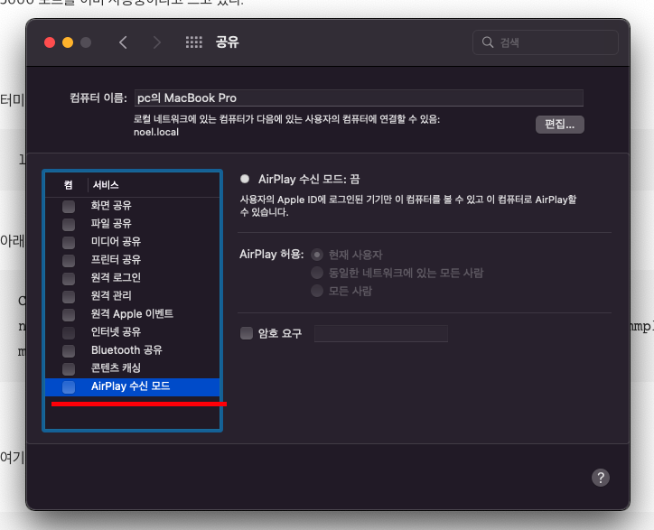

# MacOS Monterey 맥 몬테레이 port 5000 이슈(Port 5000 is already in use)

> 참고: https://medium.com/pythonistas/port-5000-already-in-use-macos-monterey-issue-d86b02edd36c
> 참고: https://o-yeon.tistory.com/92

업무 중에 갑자기 port 5000으로 접근이 불가능해졌다.

```
$ lsof -i tcp:5000
$ kill -9 PID
```

위의 터미널 명령어로 5000을 강제로 종료해도 계속 다시 5000에서의 프로세스가 살아나서 곤란했다.

결론은 MacOS Moterey 버전에서 AirPlay 기능이 port 5000을 사용하기 때문에 서버 중복 현상이 발생했고, 프로세스가 계속 살아났던 것이다.

## 해결 방법

### 1. 시스템 환경설정에 들어간다.


### 2. '공유'로 들어간다.



### 3. AirPlay 수신모드를 해제한다.



위와 같이 하면 해결된다.
